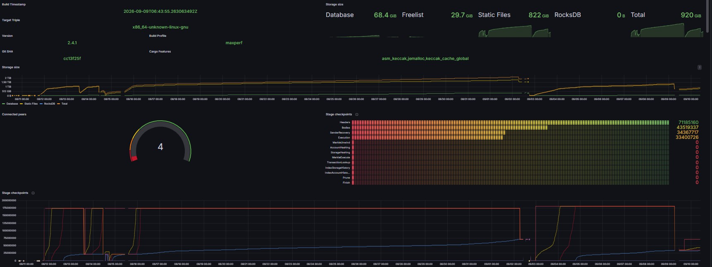

<p align="center">
  
</p>

# ‼️ Project Notice — Read Before Use ‼️

This repository is an **independent, personal experiment**. It is **not affiliated with, endorsed by, or
sponsored by Binance, BNB Chain, or any related entity**, and it is **not an official BNB Chain product**.
Any resemblance to naming used by upstream projects (e.g. "bnb-chain/reth") is retained only for historical/
attribution purposes because this repository was originally forked from that project; it does not imply any
ongoing relationship, support, or endorsement.

**Purpose of this project:** this fork exists purely to evaluate how far modern AI coding assistants ("vibe
coding") can go in modernizing and reviving a real-world, moderately complex, previously-abandoned blockchain
client codebase — rebasing it onto a current upstream ([paradigmxyz/reth](https://github.com/paradigmxyz/reth))
and porting forward protocol changes from an actively maintained downstream fork. A practical driver is that
**there are no usable, trustworthy public snapshots** for a current Reth-based BSC/opBNB archive (or full)
datadir on this stack — catching up means **syncing from the network**, which is only honest if the client
actually works. It is a technology/process evaluation, not a production initiative.

### Permitted use — private individuals only (non-commercial)

**The results of this experiment** (this repository as packaged, including author-original port/docs/skills,
effort logs, and any binaries or artifacts derived from this tree for the experiment) are made available
**only for private natural persons** for personal, educational, or hobby use.

**Not permitted** without a separate written license from the project author:

- any **commercial** use (paid services, SaaS, consulting deliverables, product bundling, token/ops revenue, …);
- any use **by or for companies / enterprises / organizations** (including internal R&D, staging, or production
  infrastructure), whether or not money changes hands;
- redistribution of this experimental packaging **for** commercial or organizational purposes.

See **`NOTICE-PERSONAL-USE.md`** for the full additional terms and the relationship to upstream licenses.

**Why not GPL / public domain for this restriction?** GPL, MIT, Apache-2.0, and public-domain dedications
all **allow commercial use**. A non-commercial / private-individuals-only policy cannot honestly be expressed
by relicensing the whole tree as GPL or “open domain.” Upstream Reth code remains under its existing
**Apache-2.0 OR MIT** terms (`LICENSE-APACHE` / `LICENSE-MIT`); those rights are **not** revoked here. The
additional personal-use terms apply to **this experiment’s packaging and author-original material** as stated
in `NOTICE-PERSONAL-USE.md`. For production BSC/opBNB, use official maintained clients.

**No warranty, no liability, use at your own risk.** This software is provided "AS IS", without warranty of
any kind, express or implied, including but not limited to fitness for a particular purpose, merchantability,
or non-infringement. The author(s) and contributors accept **no responsibility or liability whatsoever** for
any damages, financial losses, chain-consensus incidents, data loss, or other harm arising from the use,
misuse, or inability to use this software — whether run as a node, a library, or in any other capacity. This
code has **not** been security-audited and should not be trusted with real funds or run against mainnet
without independent review. If you need a supported client for BNB Smart Chain or opBNB, use one of the
actively maintained official clients instead (see upstream project links further below).

**Summary:** The results of this experiment are available **only to private individuals** for personal /
non-commercial use. **Commercial use and any use in/by companies or organizations is not permitted.**
Details: `NOTICE-PERSONAL-USE.md`. Upstream Reth remains Apache-2.0/MIT; GPL/Public Domain would permit
commercial use and are therefore **not** used for this additional restriction.

-------

# opBNB-AlteredCarbon (reth-bsc-trail workspace)

This is an experimental, community/hobbyist fork of a blockchain client based on
[Reth](https://github.com/paradigmxyz/reth/) for **[opBNB](https://github.com/bnb-chain/op-geth) only**
(chain ID **204**, binary **`op-reth`** / `make build-op`). See the project notice above for status and intent.

> **Workspace scope (2026-08-24):** All **BSC / Parlia / `bsc-reth` / `crates/bsc`** code was removed from
> this tree. Do not reintroduce BSC mainnet (chain 56) work here — use a **separate repository** if you need
> both chains.
>
> **AI agents:** When BSC and opBNB lived in the same workspace, assistants **systematically confused** chain
> context (wrong binary, wrong consensus rules, wrong live-sync checks, wrong PORT-* gates). Treat dual-chain
> monorepos as **unsafe for agent-driven port work** unless the active chain is unambiguous in path, docs, and
> session start (this repo: **opBNB only**).

**CI:** The repository includes an `op-reth` maxperf build/smoke workflow. It uses
`actions/checkout@v5` and the current `--metrics <host:port>` CLI form. Local `cargo` /
`cargo nextest` checks remain the primary validation path; see `docs/repo/ci.md`.

## Build from Source

For prerequisites and detailed build instructions please read
the [Installation Instructions](https://paradigmxyz.github.io/reth/installation/source.html).

With Rust and the dependencies installed, you're ready to build this fork. First, clone the repository:

```shell
git clone https://github.com/aidazsolt-bot/OpBNB-AlteredCarbon.git
cd OpBNB-AlteredCarbon
```

Build **op-reth** (opBNB):

```shell
make build-op
```

Or install:

```shell
make install-op
```

## Before setting up the node

### Host OS tuning (MDBX, IRQs, CPU) — no cookbook sysctls

Reth’s MDBX store is **mmap-heavy**. Kernel VM watermarks (`vm.min_free_kbytes` and friends), dirty-page writeback, THP, NUMA, CPU governor, and IRQ affinity all affect a long staged sync — and they do **not** have a single “correct” value.

**Do not copy generic `sysctl` numbers.** A value that is fine on one box in Headers can OOM, stall writeback, or burn a single NVMe/NIC CPU in Execution or hashing. The right settings depend on:

- this machine (RAM, NUMA, NVMe vs mixed disks, NIC, other processes on the node);
- the **current pipeline stage** and whether you are catch-up vs tip;
- other workloads sharing the host (CL, RPC, indexers, side jobs).

Tune **per host and per stage mix**, then re-check when the mix changes. Measure (pressure stall, `iostat`, `/proc/interrupts`, NUMA, process RSS vs file cache) instead of assuming a recipe “took.”

Use a real tuning stack; distro **defaults are not a blockchain-node profile**:

- **[TuneD](https://tuned-project.org/)** (`tuned`): start from a throughput/latency profile if you want, then **write your own** for this node. Built-in profiles do not know about MDBX mmap + staged sync. Persist VM/CPU/disk knobs in that profile (or equivalent) so they survive reboot — not a one-shot `sysctl -w`.
- **[irqbalance](https://github.com/Irqbalance/irqbalance)**: useful so NVMe and NIC IRQs are not stuck on CPU0, but **stock irqbalance policy is often wrong** for a hot node datapath. Ban/affinity (or stop irqbalance and pin IRQs yourself) after looking at `/proc/interrupts` under the stage that actually hurts. Same rule as sysctl: configure it; do not trust defaults.

This experiment does not ship a TuneD profile or irqbalance config — those belong to **your** hardware and workload, not a README.

## Run Reth for opBNB

The op-reth can function as both a full node and an archive node. Due to its unique storage advantages, it is primarily
utilized for running archive nodes.

### Hardware (ballpark — not a shopping list)

Same split as BSC. **One** opBNB archive/full node is a modest multicore + **consumer** SSD/NVMe +
tens-of-GiB-class RAM problem under catch-up. Disk still grows into the **multi-terabyte** class over a
long archive sync (capacity ≫ brand). Execution is usually CPU/disk-bound long before the NIC is.

The heavy box (many cores of *shared* CPU, large RAM pool, several NVMe volumes) is for packing **many**
EL(+CL/rollup) instances across chains and modes onto one host — still typically consumer NVMe, not a
per-node 16-core / 128 GB / “high-end NVMe” shopping list.

### Steps to Run op-reth

The op-reth is an [execution client](https://ethereum.org/en/developers/docs/nodes-and-clients/#execution-clients) for
opBNB. You need to run op-node along with op-reth to synchronize with the opBNB network.

Here is the quick command for running the op-node. For more details, refer to
the [opbnb repository](https://github.com/bnb-chain/opbnb).

```shell
git clone https://github.com/bnb-chain/opbnb
cd opbnb
make op-node

# for mainnet
export network=mainnet
export L1_RPC=https://bsc-dataseed.bnbchain.org
export P2P_BOOTNODES="enr:-J24QA9sgVxbZ0KoJ7-1gx_szfc7Oexzz7xL2iHS7VMHGj2QQaLc_IQZmFthywENgJWXbApj7tw7BiouKDOZD4noWEWGAYppffmvgmlkgnY0gmlwhDbjSM6Hb3BzdGFja4PMAQCJc2VjcDI1NmsxoQKetGQX7sXd4u8hZr6uayTZgHRDvGm36YaryqZkgnidS4N0Y3CCIyuDdWRwgiMs,enr:-J24QPSZMaGw3NhO6Ll25cawknKcOFLPjUnpy72HCkwqaHBKaaR9ylr-ejx20INZ69BLLj334aEqjNHKJeWhiAdVcn-GAYv28FmZgmlkgnY0gmlwhDTDWQOHb3BzdGFja4PMAQCJc2VjcDI1NmsxoQJ-_5GZKjs7jaB4TILdgC8EwnwyL3Qip89wmjnyjvDDwoN0Y3CCIyuDdWRwgiMs"

# for testnet
# it's better to replace the L1_RPC with your own BSC Testnet RPC Endpoint for stability
# export network=testnet
# export L1_RPC=https://bsc-testnet.bnbchain.org
# export P2P_BOOTNODES="enr:-J24QGQBeMsXOaCCaLWtNFSfb2Gv50DjGOKToH2HUTAIn9yXImowlRoMDNuPNhSBZNQGCCE8eAl5O3dsONuuQp5Qix2GAYjB7KHSgmlkgnY0gmlwhDREiqaHb3BzdGFja4PrKwCJc2VjcDI1NmsxoQL4I9wpEVDcUb8bLWu6V8iPoN5w8E8q-GrS5WUCygYUQ4N0Y3CCIyuDdWRwgiMr,enr:-J24QJKXHEkIhy0tmIk2EscMZ2aRrivNsZf_YhgIU51g4ZKHWY0BxW6VedRJ1jxmneW9v7JjldPOPpLkaNSo6cXGFxqGAYpK96oCgmlkgnY0gmlwhANzx96Hb3BzdGFja4PrKwCJc2VjcDI1NmsxoQMOCzUFffz04eyDrmkbaSCrMEvLvn5O4RZaZ5k1GV4wa4N0Y3CCIyuDdWRwgiMr"

./op-node/bin/op-node \
  --l1.trustrpc \
  --sequencer.l1-confs=15 \
  --verifier.l1-confs=15 \
  --l1.http-poll-interval 60s \
  --l1.epoch-poll-interval 180s \
  --l1.rpc-max-batch-size 20 \
  --rollup.config=./assets/${network}/rollup.json \
  --rpc.addr=0.0.0.0 \
  --rpc.port=8546 \
  --p2p.sync.req-resp \
  --p2p.listen.ip=0.0.0.0 \
  --p2p.listen.tcp=9003 \
  --p2p.listen.udp=9003 \
  --snapshotlog.file=./snapshot.log \
  --p2p.bootnodes=$P2P_BOOTNODES \
  --metrics.enabled \
  --metrics.addr=0.0.0.0 \
  --metrics.port=7300 \
  --pprof.enabled \
  --rpc.enable-admin \
  --l1=${L1_RPC} \
  --l2=http://localhost:8551 \
  --l2.jwt-secret=./jwt.txt \
  --syncmode=execution-layer
```

**It's important to mention that op-node and op-reth both need the same jwt.txt file.**
To do this, switch to the op-reth workdir and paste the jwt.txt file created during op-node execution into the current
workspace.

Here is a quick command for running op-reth. The command below is for an archive node, to run a full node, simply add
the `--full` tag.

```shell
# for mainnet
export network=mainnet
export L2_RPC=https://opbnb-mainnet-rpc.bnbchain.org

# for testnet
# export network=testnet
# export L2_RPC=https://opbnb-testnet-rpc.bnbchain.org

./target/release/op-reth node \
    --datadir=./datadir \
    --chain=opbnb-${network} \
    --rollup.sequencer-http=${L2_RPC} \
    --authrpc.addr="0.0.0.0" \
    --authrpc.port=8551 \
    --authrpc.jwtsecret=./jwt.txt \
    --http \
    --http.api="eth, net, txpool, web3, rpc" \
    --log.file.directory ./datadir/logs
```

Built-in chain names: `opbnb` / `opbnb-mainnet` (mainnet), `opbnb-testnet`, `opbnb-qa`
(so `opbnb-${network}` with `network=mainnet|testnet` is correct).
New databases default to storage V2 (`--storage.v2`; `--storage.v2=false` for legacy v1).
Do **not** pass the old BSC flags `--enable-prefetch` / `--optimize.enable-execution-cache` — they are
not wired on this rebase; use `--engine.*` prewarming/cache flags instead.

You can run `op-reth --help` for command explanations. More details on running opbnb nodes can be
found [here](https://docs.bnbchain.org/opbnb-docs/docs/tutorials/running-a-local-node/).


## Contribution

This is a personal experimental fork, not an actively maintained community project — there is no dedicated
support channel or roadmap. Thank you for considering helping out with the source code! Contributions
(forks, fixes, PRs) are welcome, but please understand this is best-effort with no guaranteed review turnaround.

Please see the [Developers' Guide](https://github.com/aidazsolt-bot/OpBNB-AlteredCarbon/tree/main/docs)
for more details on configuring your environment, managing project dependencies, and
testing procedures.

## About This Fork: Purpose, Method, and Effort Log

### What this is

This repository was resurrected from an archived, unmaintained state (last upstream release `v1.1.1`,
suspended per the notice at the top of this file) as an experiment in AI-assisted ("vibecoding") software
maintenance: rebasing a moderately large, protocol-critical Rust codebase onto a much newer upstream
release of [paradigmxyz/reth](https://github.com/paradigmxyz/reth) (targeting `v2.4.1`), resolving the
resulting merge conflicts, restructuring code around upstream's architectural changes (e.g. the `revm`
41.x execution-engine rewrite, the extraction of `crates/optimism` into a separate downstream project,
and the `blockchain-tree` → `engine-tree` migration), and porting forward opBNB-specific protocol/hardfork
changes from [bnb-chain/opbnb](https://github.com/bnb-chain/opbnb). The explicit goal was to evaluate how
far current-generation AI coding assistants can carry this class of work — not to produce a production-ready
or officially supported client.

**Availability:** experiment results are for **private individuals only** (personal / non-commercial).
**Commercial use and any company/enterprise use are not permitted.** See the Project Notice and
`NOTICE-PERSONAL-USE.md`. Upstream Reth remains Apache-2.0 OR MIT; this project does **not** relicense
the tree as GPL or public domain (those allow commercial use and would not express the NC intent).

### Notable protocol / sync fixes (visible in commit history)

These are places where stock upstream / the archived trail were insufficient for a real opBNB archive
catch-up. Each item is a **named commit** on the public `main` history (milestone publish), not only a
note in `plan.md`:

| Area | What was wrong | Public-facing fix commit subject |
| --- | --- | --- |
| Storage v2 | ChangeSets/Senders stubs could corrupt Headers; manual layout flips could create MDBX/static-file/RocksDB hybrids | `7cdbac95ed fix(storage): stop AccountChangeSets SF stub from corrupting Headers` → `ecc908745a feat(storage): port StorageChangeSets static-file segment for v2`; direct `storage_v2` changes now refuse and `db migrate-v2` resumes partial ChangeSet copies |
| Consensus | Eth second-granularity timestamp rejected valid opBNB equal-second blocks | `ac0d2510e0 fix(target-chain): milli-timestamp consensus + engine backfill for live sync` |
| Engine | Tip chase / no pipeline backfill after FCU | same commit `(ENGINE-001)` + tip seed in P2P-003 |
| eth/69 (+) | Tip hash without number; peers without range; Empty→Ban; BlockRange unused | `b878379528 fix(net): PORT-P2P-003 reachable headers + tip seed` |
| Headers downloader | Cap re-loop / Falling stuck at `total=1` | `d0bcd8e5f6 fix(net): prime Falling after Cap Number tip` |
| NAT | `--nat any` without real UPnP; undialable announce | `600d5e9686 feat(net): UPnP NAT map + eth/69 handshake breach; docs P2P-002 live` |
| Execution | Receipt-root fail @ Hertz/`0x67` (`21591154`) | `d5064083b8 fix(op)+docs: CometBFT Hertz overlay for PIPE-014 receipt root` |
| Wright L1 fee | Skip semantics must match op-geth (`gasPrice==0`) | `a73e60e883 fix(op-revm): add skip l1 data fee support` |

Hardfork wiring (Fermat/Haber/Wright) and live Point-4 / ETA docs are separate commits further up the
same history. Full gate matrix: `plan.md` (`PORT-*` / `PORT-PIPE-*` / `PORT-FLOW-*`).

### Method

Work was performed interactively with AI coding agents across multiple sessions — primarily
**GitHub Copilot CLI** (session `a95758da`, 2026-08-06–07) and follow-on **Cursor Composer**
sessions (2026-08-09–11) — using a mix of direct agent-driven edits and delegated background
sub-agents supervising/verifying each other's changes (given the scale of the merge — 200+
conflicting files across the initial rebase alone). Progress was checkpointed via small,
incrementally verified git commits where possible, specifically to keep the change history
auditable and revertible given the semi-autonomous nature of the work. Large mid-session compile
loops may leave uncommitted working-tree diffs until explicitly reviewed (see `plan.md`).

### Method finding: AI needs an explicit porting skill / approach hints

A central result of this experiment: **generic AI coding agents were not able to perform a
meaningful protocol port on their own.** They can drive large compile/fix loops and surface
plausible diffs, but without **operator-supplied approach hints** (reference-first against
`bnb-chain/op-geth`, stage-by-stage live verify, dual **`PORT-PIPE` + `PORT-FLOW`** matrices,
Engine vs Pipeline vs Consensus vs Downloader layering) they repeatedly stop at “builds green”
or chase the wrong layer (e.g. Eth second-resolution timestamps, tip-chase instead of backfill,
Cap/Falling stalls treated as “live follow-ups” instead of missing dataflow analysis).

Those hints were therefore given explicitly during live-sync debugging (Session 10). From that
procedure the agent was instructed to author a reusable Cursor skill; Session 10 cont. then
hardened `plan.md` with a mandatory **Migrations-Gate** (PIPE = consensus rule, FLOW = state
machine / wire / persistence) so Bodies/Execution cannot repeat the Headers dataflow gap:

- **`.cursor/skills/reth-opbnb-port/SKILL.md`** — *Reth / opBNB Portierungs-Spezialist*
- **`.cursor/skills/rust-best-practices/SKILL.md`** — *Experienced Rust / best practices*
- **`.cursor/rules/reth-opbnb-port-mandatory.mdc`** — `alwaysApply: true` (load both skills first every session)
- **`.cursor/hooks.json`** `sessionStart` — injects both skills into agent context

Subsequent port/sync work on this fork **must** load both skills at session start (rule + hook enforce it)
and follow `plan.md` (**`PORT-PIPE-*` and `PORT-FLOW-*`**, DoD before live) instead of unaided vibecoding.

### Effort log (approximate, based on available session telemetry)

| Metric | Value |
| --- | --- |
| Elapsed wall-clock time (this rebase effort, across sessions) | Main rebase/live-sync effort: **2026-08-06 → 2026-08-17**. Multiple sessions over this window (Copilot: ~2026-08-06 09:50 UTC start; Cursor Session 6: **2026-08-09**, ~5.34 h; Session 8: **~2026-08-09**, ~2.1 h; Session 9: **~2026-08-10**, ~1.9 h; Session 10 live sync: **2026-08-11**, chat `84eb0b61…`, **~4.8 h** Wall; **Session 12** chat `ea987bef…`: calendar **~88 h** 08-12→16, interactive clusters **~4.5 h** early + **~4 h** 08-15 evening / 08-16 morning). Later 2026-09-01/02 work was follow-up diagnosis/recovery hardening, not the original project start window. |
| LLM models used (Copilot session `a95758da`) | Claude Sonnet 5 (primary), GPT-5.4, Claude Sonnet 4.6, GPT-5.3-Codex, GPT-5.4-mini |
| LLM models used (Cursor Session 6, chat `42f88fe7…`) | **composer-2.5-fast** + **cursor-grok-4.5-high-fast**; parent `default` |
| LLM models used (Cursor Session 8, chat `d6ebb428…`) | Parent Auto/Composer router; ~816 tool calls in agent transcript |
| LLM models used (Cursor Session 9, chat `6a6455c9…`) | Parent Auto/Composer router + Task subagents (inherit); ~250 tool_use in resume transcript |
| LLM models used (Cursor Session 10, chat `84eb0b61…`) | Parent Auto/Composer; live opBNB archive sync — CONS/ENGINE + **P2P-003/004/005** + **Migrations-Gate PIPE+FLOW** |
| LLM models used (Cursor Session 12, chat `ea987bef…`) | Parent Auto/Composer (+ occasional Task); **84** user / **367** assistant; **567** tool_use |
| Approx. input tokens (Copilot `a95758da`) | **~650.1M** (+ ~636.2M cache-read) |
| Approx. output tokens (Copilot `a95758da`) | **~1.861M** |
| Approx. model wall time (Copilot `a95758da`) | ~8.1 hours / 5,803 usage events / 32 turns |
| Cursor Session 6 activity | **15 agents**; 2,582 assistant msgs; ~11,722 tool-calls; **74,482** `ai_code_hashes`; transcript proxy **~0.58M tokens** |
| Cursor Session 8 activity (op-evm→cli/bin→smoke) | Transcript **~0.45M chars → ~0.11M tokens** (÷4 proxy); **11,288** `ai_code_hashes`; 350 assistant / 18 user msgs in jsonl |
| Cursor Session 9 activity (STOR-006 + Phase-5 nextest/EF) | Resume **~0.11M chars → ~28K tokens** + prior SCS chat **~0.28M chars → ~69K** (÷4 proxy, combined **~97K**); 12 user / 118 assistant; 250 tools resume |
| Cursor Session 12 activity (EXEC-001 → UPnP / past Fail / X02 / A02) | Snapshot **08-16:** Transcript **~1.58 MB** → proxy **~396K tokens** (filesize÷4); calendar **~88 h**; interactive **~4.5 h** early + **~4 h** 08-15 evening/08-16 morning; billed **n/a** — source artefacts are local-only and not published |
| Copilot Session 13 activity (Storage-v2 recovery, root-cause analysis and fixes, 2026-09-02) | Journal/Mimir diagnosis of the receipt-static-file unwind; Storage v2 migration/consistency changes; source-level root-cause analysis on `main` yielding two fixes (static-file block-index underflow `fa6caf3022`, slot-preimage DB port `ce0c722d9b`); six reactivated preimage regression tests plus `test_pipeline`/`test_pipeline_v2`, `cargo check --workspace` and two `make maxperf-op` builds. Per-session billed-token telemetry is unavailable; no incremental monetary estimate is claimed. |
| Session 10 maxperf rebuilds (test/deploy cost) | 3 successful fat-LTO builds @ ~20–23 min each (`CARGO_BUILD_JOBS=1`); plus failed tipresolve SIGKILL; unit tests fetch 43 + reverse_headers 11 |
| Illustrative API-equivalent cost (Copilot only, **not an invoice**) | Order-of-magnitude **~USD 1.5–2k** if the ~650M in / ~1.9M out were billed at public Sonnet/GPT list bands without cache discount. Cursor billed usage is **not** available on disk — use the Cursor account dashboard. Session 12 content proxy undercounts context resend; subscription pricing ≠ raw API. |
| Compile / runnable milestone (2026-08-10, Session 9) | StorageChangeSets SF (**PORT-STOR-006**); stages nextest **106/106**; EF **v17.0** → **62/62**. Catch-up/full sync = **human-owned** (see `plan.md`). |
| Live sync milestone (2026-08-11, Session 10) | **PORT-CONS-001**; **PORT-ENGINE-001/003**; **PORT-P2P-003/004/005** (reachable tip + Cap idempotent + Falling-Prime — Downloader-Dataflow, not live follow-ups): Falling from peer head ~173.37M @ ~22k hdr/s. Checkpoint 0 until ETL write (Upstream TempDir). |
| Live sync progress (2026-08-12 ~17:03 CEST) | Headers+Bodies+**Sender** = Tip **173 369 140**. **Execution ~10 M (~5.8 %)**, Fermat **`9397477` Point4 MATCH** (IPC). Block-ETA ~**24–25 h** (entities-lag → 2–4 d). CL Tip ~173.7 M (op-node Tip-Feed; L1-re-org warns = Dataseed noise). Next: Haber / FLOW-X02. Details: `plan.md` § Live Sync Progress. |
| Live sync + Session 12 (2026-08-13 ~16:00 CEST, chat `ea987bef…`) | **PORT-EXEC-001** receipt-root @ **`21591154`** → Unwind FLOW-X05 → Headers Tip **~174.0 M** again; Bodies rebuild. Harness + `re-execute --dump-receipts-on-fail`; maxperf rebuild-only `target/maxperf/op-reth` (~22 min). **Ops:** Exec ≤`21591153` then offline FLOW-X04. Upstream: stay on **2.4.1** (bnb/op not on 2.5). |
| Live sync Session 12 cont. (2026-08-14 ~13:35 CEST) | **2. Fail** same `21591154` (~5 min Exec). Cap: **`--debug.max-block`** (+`terminate`); `skip-fcu`≠block stop. Journal via container-host journal. MerkleExecute @ `21579110`. |
| Live sync Session 12 cont. (2026-08-14 ~18:01 CEST) | Dirty Cap → Merkle fail @`21579110` → unwind_to=0; Kill rettet Headers Tip **174 M**. Reload/Stop Panic `SelectNextSome` (ENGINE-004 parked). Bodies clean **0→21579110**. **Ops:** Process-Stop ≫ max-block; Cap only if checkpoints ≤ H (OPS-001). |
| Live sync Session 12 cont. (2026-08-14 ~21:26 CEST) | Bodies+Sender Cap ✅; Exec ~**6.5 M**→`21579110`. Point4 via IPC `/tmp/<archive-ct>.ipc` MATCH (no HTTP without `--http`). PORT-OPS-001/ENGINE-004 in `plan.md`. |
| Live sync Session 12 cont. (2026-08-15 ~10:54 CEST) | Offline X04 + SF-Gap + **Effort-Metriken**: Bodies/Sender→`21591154`; SF tip `20365614`≠Cap; Exec→`21591153`; CLI half-open `54..55`. Agent: **~4.5–6 h** interactive / proxy **~72K–216K** tok; source artefacts local-only. |
| Live sync Session 12 cont. (2026-08-15 ~11:47 CEST) | Docs: op-geth `ValidateState` (receipt+state eager) vs Reth Execution+MerkleExecute staged; `21591154` = receipt content (PIPE-014), not state-root formula. |
| Live sync Session 12 cont. (2026-08-15 evening → 08-16 ~08:30 CEST) | **P2P-002** UPnP live; Bodies+Sender Tip **174 M**; Exec past **`21591154`** (~22.7 M↑); **X02/PIPE-009** ≡ op-geth (Unit); CLEANUP-A02 partial. ETA Haber ~16–19 h / Wright ~1.5–2 d / Tip ~3–4 Wo. Metrics source artefacts local-only. |
| Live sync (2026-08-17 ~16:05 CEST) | Exec **~31.5 M↑** (~18 % Headers tip); **Haber Point-4 MATCH** (`27118477` + Fermat/Fail/mid); validation_errors **0**; Wright ETA ~7–11 h @ then-current rate. |
| Live sync (2026-09-01 ~18:52 CEST) | Headers/Bodies/SenderRecovery **174 027 661**; Exec **`65 828 907`** (~38 % Headers tip); **past Wright**; rate cooled ~**19–33 blk/s** (24 h ~22); ETA Headers tip **~1¼–2¼ Mo** (current bands). Peers 16; validation **0**. Snapshot source artefact local-only. |
| Storage-v2 recovery / Session 13 (2026-09-02, root cause 16:30 CEST) | The archive datadir has been running **continuously with `storage_v2=true` since at least 2026-08-14**; no manual layout change occurred. Root-cause analysis on `main` found two porting defects: (1) `StaticFileProvider::update_index` encoded the block index under `segment_max_block` instead of under the end of the range, causing `find_fixed_range_with_block_index` to trigger a u64 underflow — in the release build a **silent wrap** that reported existing static-file data as missing (`segment=Receipts` @ `71 185 160`, triggering the unwind `174 027 661 → 71 185 159`); fixed in `fa6caf3022`. (2) The slot-preimage DB from upstream #22379 had never been ported, only its tests had been disabled via `#[ignore]` — as a result, V2 wipe-changesets remained incomplete; backported in `ce0c722d9b`, 6/6 tests green. The subsequent datadir autopsy revealed a mixed state (`HashedAccounts` actually at `71 242 925`, `HashedStorages` actually at `70 885 156`, static files at `71 185 159`); repair was no longer possible locally due to truncated AccountChangeSets, hence a re-sync from genesis. Additional local guards: storage-V2-aware `stage drop Execution`, a loud `remove_state_above` abort when execution is ahead of block data, startup abort when execution equals the header tip but hashing lags behind, and a hashed-state clear on hashing unwind to genesis (`3906c694f8`). |
| `migrate-v2` clean-run validation (2026-09-03) | Dev-host isolated test: V1-synced datadir (0→300 via `--storage.v2 false` + `--debug.tip`/`--debug.terminate`) → `db migrate-v2` → rebuild restart. No errors; `storage_v2: true` persisted; all 13 stage-checkpoints consistent @300 after rebuild (`MerkleExecute` 100%). Does not exercise crash-resume (mid-migration interruption), which remains untested. |
| opBNB peer-connectivity investigation (2026-09-03) | Live archive node degraded from historical 8–17 to constant 5 connected peers. Confirmed real opBNB EIP-2124 ForkHash is `45eac6aa` (ENR key `"eth"`), not our own transient pre-Canyon `"opel"` self-tag `716d4a3a`. No official static opBNB peer list exists (`bnb-chain/opbnb#105`/`#310`, unaddressed since 2024). Verified via isolated `p2p body` reachability test that 6 candidate peers fail at the ECIES layer from this dev host while a known-connected peer succeeds immediately — failure is host-specific (capacity/reputation), not a local network/tooling issue. A dev-host systemd timer periodically retrying `admin_addTrustedPeer` for the capacity-limited candidates was tried and then removed again: reth already rediscovers such peers via discv5 and retries them itself with backoff, and trusted peers are exempt from the backoff-count removal guard, making a separate injection timer largely redundant. `.cursor/local/opbnb-peer-inject.py` (gitignored) is kept for ad-hoc manual injection. |
| PORT-P2P-006 / FLOW-N01 dual-stack live verification (2026-09-03) | Confirmed the two already-merged commits `4bbdd60fd6`/`45db221aeb` fully resolve the long-open dual-stack bind/dial/announce item (plan status was merely stale). Isolated dev-host test (no `--addr`) showed `discv5::service: Discv5 Service started mode=DualStack`, real UDP bindings on both `0.0.0.0:9200` and `[::]:9200`, and NAT announcing both families separately (`Announced dialable enode` for IPv6, `Announced additional discv5 dual-stack NAT endpoint` for IPv4). The live archive node still runs with explicit `--addr 0.0.0.0` (single-family, unchanged); the dual-stack path was verified only in an isolated dev-host test, not on the production node. |
| Public repo hygiene | Repository was recreated from a sanitized local-only history on 2026-09-02. `main` starts at 2026-08-06, has one normalized author, no inherited upstream parents/tags, no `.github/CODEOWNERS`, only the op-reth smoke workflow under `.github/`, and no `files/` artefacts anywhere in public history. |
| Commits | See `git log --first-parent main`; public history was rebuilt as sanitized local-only commits on 2026-09-02 and later cleaned so `files/` never appears in `main` history. |
| Metrics snapshots | Local-only operator artefacts. `files/` is intentionally ignored and not published because it may contain session paths, local telemetry, and forensic scratch data. |
| Maxperf binary (local, **not committed**) | `make maxperf-op` → `target/maxperf/op-reth` + install under `dist/bin/` with a dedicated binary name (avoids clobbering a generic `op-reth` on PATH); default CLI chain `opbnb` |

#### Operator / senior admin–dev effort (human-owned)

AI agents did not “run the archive alone.” A **senior operator / admin-dev** owned the experiment boundary:

| Role | What was human-owned (transparent, not a timesheet) |
| --- | --- |
| Methodology | Supplied reference-first + **PIPE+FLOW** gates when unaided vibecoding stalled (Session 10); required dual skills every session |
| Live archive | Started/kept the opBNB archive sync; process stop vs `--debug.max-block` (OPS-001); tip-rescue kill before Headers unwind-to-0; no mid-Exec restarts for casual debug |
| Build / deploy | Fat-LTO `maxperf` rebuilds (~20–23 min each), binary install, flag/datadir/IPC/metrics wiring (paths anonymized in public docs) |
| Verify | Point-4 / public-RPC spot-checks; receipt-root harness direction; when to park before fail height |
| Calendar (order of magnitude) | **2026-08-06 → 2026-08-17**: multi-day machine wall for Headers→Bodies→Sender→Execution; interactive operator clusters roughly track the agent sessions above (**tens of hours** directed review/ops across the window, not continuous keyboard time). Later September entries are incident/recovery follow-ups. |
| Cost beyond LLM | Host CPU/NVMe/network for archive sync + rebuilds — **not** monetized here; LLM illustrative cost above is Copilot-API-equivalent only |

Catch-up / full tip sync and long-running Execution remain **human-owned** (agent may analyze metrics/logs; operator starts and owns the run).

These figures are session telemetry snapshots and are illustrative of the scale of context/inference
required for this kind of large structural migration; earlier pre-`a95758da` sessions add further
consumption (see historical rows in `plan.md`). They are provided for transparency about the practical
cost of AI-assisted maintenance at this scale, not as a benchmark claim — no rigorous token-efficiency
optimization was attempted. Copilot token counts include tool/context repetition per turn; Cursor
figures mix activity counts with content-size token **proxies** where a billed meter is unavailable.

> **TODO:** After human catch-up/full sync validation on BSC/opBNB, refresh final cumulative token/time
> figures (replace Cursor proxies with account billing export if available) and live-test outcome.

### Side-evaluation: `kona-node` as an alternative to `op-node` for opBNB

While blocked on the `crates/primitives` legacy-API remediation (see commit history), a live test of
[`kona-node`](https://github.com/op-rs/kona) (a modern Rust rollup-node implementation, evaluated from a
local checkout under `optimism.git/rust/kona`) was run against opBNB mainnet config, using an
in-progress `reth` (this fork) instance as the L2 engine and public BSC RPC endpoints as the L1 source.

**Outcome:** `kona-node` crashed on startup with
`Failed to load genesis time from beacon client: Backend("HTTP request failed: error decoding response body")`
(`kona/crates/providers/providers-alloy/src/blobs.rs:61`, `OnlineBlobProvider::init()`). Root cause: BSC does
not expose a standard Ethereum Beacon Chain API (`bsc-dataseed.bnbchain.org` is an execution-layer JSON-RPC
endpoint, not a beacon API), and `kona-node`'s `OnlineBlobProvider::init()` unconditionally fetches beacon
genesis time/slot-interval via `.expect(...)`, with no non-beacon fallback in that code path. This is not a
BSC/opBNB-specific defect in `kona-node` itself; `op-node` (Go) has the same underlying dependency on an L1
Beacon API for blob-derivation post-Ecotone, currently disabled in `bnb-chain/opbnb`'s fork
(`op-node/node/config.go` — the Ecotone Beacon-API-required check is commented out).

**Mitigation found:** `kona-node` already ships a flag for exactly this situation:
`--l1.slot-duration-override <seconds>` (`kona/bin/node/src/flags/engine/providers.rs`,
`kona/crates/node/service/src/service/builder.rs`), which bypasses the initial beacon-spec fetch by supplying
a fixed L1 slot duration instead of querying it from a beacon client. This was identified but not yet
re-tested end-to-end (blocked on the same `reth-bsc-trail` compile blockers as the main port); a live retest
with this flag is a recommended next validation step.

**Assessment — should we switch to `kona-node`?**
- `kona-node` is architecturally more modern (Rust, matches this project's `reth` stack, actively developed,
  and already spec-aware up to the Isthmus/Jovian/Karst/Lagoon hardforks per its own startup log), which is
  attractive for a project whose stated goal is evaluating modern tooling.
- However, it is materially less proven in production than `op-node` for exotic L1s like BSC that lack a
  genuine Beacon Chain API — the blob-provider assumption is baked in fairly deep and needs the
  slot-duration-override workaround (or a proper "no-beacon" derivation mode) to function at all here.
- **Recommendation:** keep `op-node` (via `bnb-chain/opbnb`) as the primary/default rollup-node for opBNB in
  this fork for now, but track `kona-node` as a promising secondary/experimental option once the
  slot-duration-override path is validated live. Do not switch defaults until a full derivation-to-tip sync
  has been demonstrated against opBNB with `kona-node`.
- Regarding upstream `reth`/`op-reth` rollup defaults: the mainline `reth-optimism-*` crates already bundle
  the standard OP-stack hardfork schedule (Regolith through Isthmus and beyond) as of the `v2.4.1` base this
  fork rebases onto — no separate/manual hardfork-default wiring is needed there; opBNB-specific deviations
  (Snow/Volta/Fourier and similar) are what still needs explicit porting in this fork's BSC/opBNB crates.

> **TODO:** Re-run this `kona-node` evaluation live with `--l1.slot-duration-override` once
> `reth-bsc-trail` compiles again, and record whether it reaches a synced L2 tip against opBNB
> mainnet/testnet, including timing and any further blockers found.

### Status disclaimer (repeated for emphasis)

As stated at the top of this document: this is an unaudited, experimental fork with **no warranty and no
liability accepted by the author(s)** for any use of this software. It is not affiliated with or endorsed
by Binance or BNB Chain. Treat it as a research/engineering case study, not as infrastructure to depend on.
